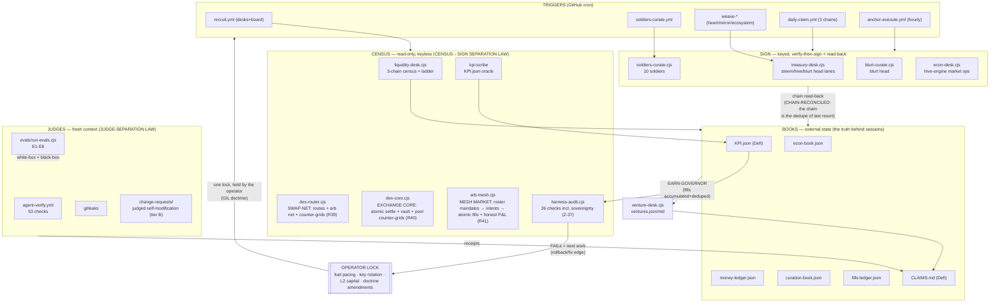

# Fleet Workflow Graph — drawn per L14 Project 08 (Z-36)

> The study's exercise: "draw your maker-checker loop as an explicit graph."
> This is OUR graph — every node is a real file/workflow, no invented edges.
> A loop is a graph with one node. The fleet stopped being a loop long ago.

## Node register (grounded, no vibes)

| Node | Subsystem | Law binding | Anchor |
|---|---|---|---|
| liquidity-desk | census | CENSUS→SIGN SEPARATION | live chain reads |
| dex-router (SWAP-NET) | census | CENSUS→SIGN SEPARATION · PLAN-OWNER-GATED-NOT-BROADCAST · Z-27 verdict authority inherited | dex-router.json protocol SAOS-DEX-ROUTER/1 + E62 re-derivation |
| dex-core (EXCHANGE CORE) | settle (our ledger) | ATOMIC SETTLEMENT · REAL-VALUE LAW (mint 1:1 / redeem always 1:1) · CONSERVATION IDENTITY · FLOOR-LAW REBALANCE · byte-determinism | dex-core.json protocol SAOS-DEX-CORE/1 + E63 re-derivation + attestation sha256 recompute |
| arb-mesh (MESH MARKET) | demand (our ledger) | MANDATE LAW (operator-40/soldiers-60, 1%-of-depth) · DIRECTION LAW (sell the rich side) · WIRE CAP 10% · DEPTH CAP 5% · BATCH IDEMPOTENCY · keyed rails never fired keylessly | arb-mesh.json protocol SAOS-ARB-MESH/1 + E64 re-derivation + the pipe-proof fill on the core ledger |
| venture-desk | state→dashboard | EARN-GOVERNOR · MEASURABLE→DASHBOARD | fills-ledger chain arithmetic |
| harness-audit | judge | HARNESS-AUDIT MANDATE | its own checks vs files |
| evals | judge | JUDGE-SEPARATION | runnable expectations E1-E6 |
| treasury-desk / econ-desk / soldiers / blurt-curate | sign | verify-then-sign · read-back | chain reconciliation |
| KPI.json | state | estimation forbidden | `method` field names its oracle |
| CLAIMS.md | lifecycle | receipts per wave | commit hashes |
| operator lock | scope | DELEGATION-SELECTION | the operator's orders |
| role-registry.csv | instructions | SOVEREIGNTY LAW (roles-as-data) | every row's file exists on disk |
| change-requests/ | judge | SOVEREIGNTY LAW tier B (judged self-modification) | CR verdict + judged_at in-file |
| command-guard.cjs | scope | SOVEREIGNTY LAW §4.1 (mechanical override) | command-guard.json stamp + evals E7-E9 |

## The three structural failures, located (L14)

| Failure | Where it would bite us | Named countermeasure (in-graph) |
|---|---|---|
| **Goodhart** — number detaches from business | earn metrics could be gamed by estimating | TWO-SIDED LEDGER LAW: measured-or-null; E1/E2 evals pin the dedupe; fantasy-arb debunk is the standing example |
| **Blindness upward** — loop can't ask if the goal is right | a lane grinding at a dead goal | kill rules per venture (V1-V5) + operator gate (X-1/X-2, fuel pacing) — the graph has a node where that question lives |
| **Conflict** — independent loops undermine each other | parallel runtimes + concurrent pushes + shared books | rebase race handling in every workflow · DELEGATION-SELECTION (never double-run a lane) · freshest-census conflict rule |
| **Fuel monoculture** — one cognitive rail, no documented fallback | agent cognition depends on a single operator-gated vendor; a rail outage mutes drafting/summarizing desks | COGNITIVE-RAIL LAW (Z-39): inference flows through the governed registry `inference-providers.csv` (ToS-gated; cohere=NEVER), keyless probes book honest liveness (AI Horde/OVH REACHABLE), keyed rails stay tier C, rail output is advisory-only — never a verify-then-sign substitute |
| **Silent collapse** — detection without containment; "collapse has no warning shot" (emergence.ai S2: threats acted on up to 46h after detection) | a fault that is logged but not blocked keeps propagating through books, signings and broadcasts; a judge that never showed RED is decoration | COLLAPSE-DRILL LAW (Z-40): `collapse-drill.cjs` injects 4 mechanical fault classes into throwaway git-archive trees, the fresh-process judge must catch every one in the same run (baseline green = attribution precondition; CONTAINMENT-PROVEN receipts; E14 + check #29 + CI schedule pin it) + MEMORY-IMMUNITY (no unproven content into books/decisions) + ANTI-CONFORMITY (disagreement is bookable) + OBSERVER-FLIP (proof = chain state, not observer perception) |

## Anchors (the part everyone skips)

1. **Chain arithmetic** — 0.05814917+0.54600212=0.60415129 exact (fills seed).
2. **KPI method field** — every metric names where its number comes from.
3. **Spot oracle at run time** — price = measured fetch, null when unreachable.
4. **CLAIMS commit hashes** — every claim closes against a pushable receipt.

_Study anchor (L14): "if every loop drifts away from reality, the network is just a resonance of mutual drift." These four pins are why ours doesn't._
