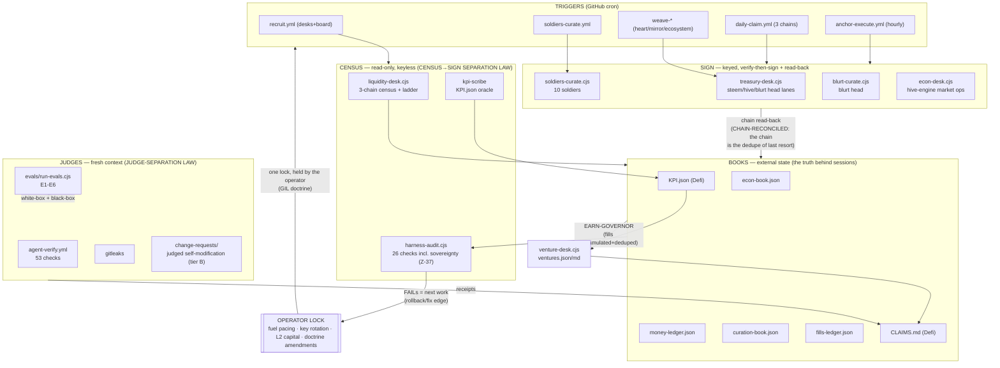

# Fleet Workflow Graph — drawn per L14 Project 08 (Z-36)

> The study's exercise: "draw your maker-checker loop as an explicit graph."
> This is OUR graph — every node is a real file/workflow, no invented edges.
> A loop is a graph with one node. The fleet stopped being a loop long ago.

## Node register (grounded, no vibes)

| Node | Subsystem | Law binding | Anchor |
|---|---|---|---|
| liquidity-desk | census | CENSUS→SIGN SEPARATION | live chain reads |
| venture-desk | state→dashboard | EARN-GOVERNOR · MEASURABLE→DASHBOARD | fills-ledger chain arithmetic |
| harness-audit | judge | HARNESS-AUDIT MANDATE | its own checks vs files |
| evals | judge | JUDGE-SEPARATION | runnable expectations E1-E6 |
| treasury-desk / econ-desk / soldiers / blurt-curate | sign | verify-then-sign · read-back | chain reconciliation |
| KPI.json | state | estimation forbidden | `method` field names its oracle |
| CLAIMS.md | lifecycle | receipts per wave | commit hashes |
| operator lock | scope | DELEGATION-SELECTION | the operator's orders |
| role-registry.csv | instructions | SOVEREIGNTY LAW (roles-as-data) | every row's file exists on disk |
| change-requests/ | judge | SOVEREIGNTY LAW tier B (judged self-modification) | CR verdict + judged_at in-file |
| command-guard.cjs | scope | SOVEREIGNTY LAW §4.1 (mechanical override) | command-guard.json stamp + evals E7-E9 |

## The three structural failures, located (L14)

| Failure | Where it would bite us | Named countermeasure (in-graph) |
|---|---|---|
| **Goodhart** — number detaches from business | earn metrics could be gamed by estimating | TWO-SIDED LEDGER LAW: measured-or-null; E1/E2 evals pin the dedupe; fantasy-arb debunk is the standing example |
| **Blindness upward** — loop can't ask if the goal is right | a lane grinding at a dead goal | kill rules per venture (V1-V5) + operator gate (X-1/X-2, fuel pacing) — the graph has a node where that question lives |
| **Conflict** — independent loops undermine each other | parallel runtimes + concurrent pushes + shared books | rebase race handling in every workflow · DELEGATION-SELECTION (never double-run a lane) · freshest-census conflict rule |

## Anchors (the part everyone skips)

1. **Chain arithmetic** — 0.05814917+0.54600212=0.60415129 exact (fills seed).
2. **KPI method field** — every metric names where its number comes from.
3. **Spot oracle at run time** — price = measured fetch, null when unreachable.
4. **CLAIMS commit hashes** — every claim closes against a pushable receipt.

_Study anchor (L14): "if every loop drifts away from reality, the network is just a resonance of mutual drift." These four pins are why ours doesn't._
